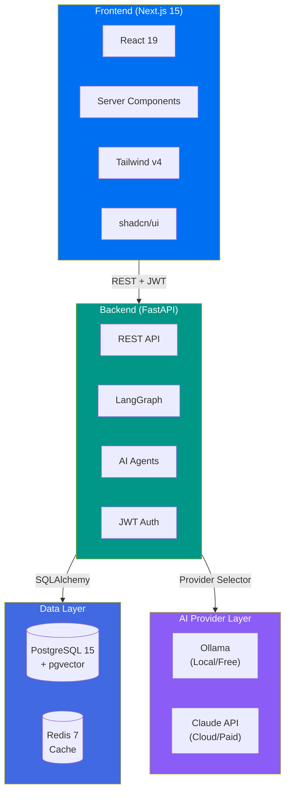
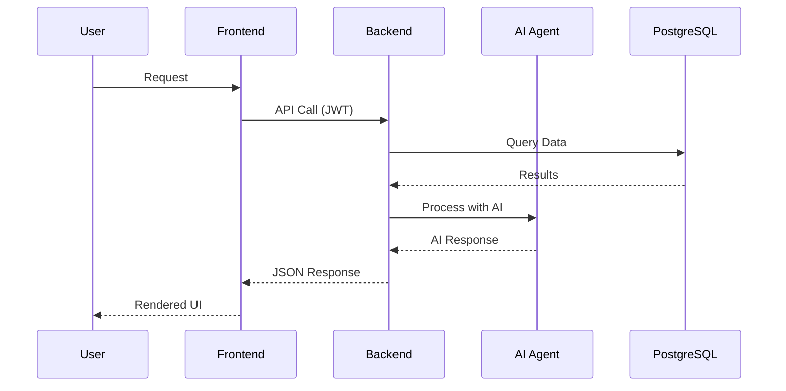

<div align="center">

<!-- HERO BANNER -->
<picture>
  <source media="(prefers-color-scheme: dark)" srcset="https://raw.githubusercontent.com/CleanExpo/NodeJS-Starter-V1/main/.github/assets/banner-dark.svg">
  <source media="(prefers-color-scheme: light)" srcset="https://raw.githubusercontent.com/CleanExpo/NodeJS-Starter-V1/main/.github/assets/banner-light.svg">
  
</picture>

<br/>

# NodeJS-Starter-V1

### Self-Contained AI Application Template

<p align="center">
  <strong>Build AI-powered applications without API keys, cloud accounts, or external dependencies</strong><br/>
  <em>Production-ready | Offline-first | Free forever</em>
</p>

<!-- TECH STACK BADGES -->

[](https://nextjs.org/)
[](https://fastapi.tiangolo.com/)
[](https://www.typescriptlang.org/)
[](https://python.org/)
[](https://tailwindcss.com/)
[](https://postgresql.org/)

<!-- STATUS BADGES -->
<p align="center">
  
  
  
  
  
</p>

<!-- NAVIGATION -->
<p align="center">
  <a href="#-quick-start">Quick Start</a> |
  <a href="#-architecture">Architecture</a> |
  <a href="#-features">Features</a> |
  <a href="#-documentation">Docs</a> |
  <a href="#-development">Development</a>
</p>

---

### One-Command Setup

```bash
git clone https://github.com/CleanExpo/NodeJS-Starter-V1.git && cd NodeJS-Starter-V1 && pnpm run setup && pnpm dev
```

<sub>No API keys | No accounts | No configuration | Just works</sub>

</div>

---

## Architecture



<details>
<summary><strong>View Data Flow Diagram</strong></summary>



</details>

---

## Quick Start

<details open>
<summary><strong>Prerequisites</strong></summary>

| Tool    | Version | Download                         |
| ------- | ------- | -------------------------------- |
| Docker  | Latest  | [docker.com](https://docker.com) |
| Node.js | 20+     | [nodejs.org](https://nodejs.org) |
| Python  | 3.12+   | [python.org](https://python.org) |
| pnpm    | 9+      | `npm i -g pnpm`                  |
| Ollama  | Latest  | [ollama.com](https://ollama.com) |

</details>

<details open>
<summary><strong>Installation</strong></summary>

```bash
# 1. Clone repository
git clone https://github.com/CleanExpo/NodeJS-Starter-V1.git
cd NodeJS-Starter-V1

# 2. Run automated setup
pnpm run setup              # macOS/Linux
pnpm run setup:windows      # Windows

# 3. Start development
pnpm dev
```

</details>

<details>
<summary><strong>Verify Installation</strong></summary>

```bash
pnpm run verify
```

| Service     | URL                    | Status  |
| ----------- | ---------------------- | ------- |
| Frontend    | http://localhost:3000  | Running |
| Backend API | http://localhost:8000  | Running |
| PostgreSQL  | localhost:5432         | Running |
| Redis       | localhost:6379         | Running |
| Ollama      | http://localhost:11434 | Running |

**Default Login:** `admin@local.dev` / `admin123`

</details>

---

## Features

<table>
<tr>
<td width="50%" valign="top">

### Frontend

- **Next.js 15** with App Router
- **React 19** Server Components
- **Tailwind CSS v4** + design tokens
- **shadcn/ui** component library
- **TypeScript** strict mode
- **Vitest** + Playwright testing

</td>
<td width="50%" valign="top">

### Backend

- **FastAPI** async Python
- **LangGraph** agent orchestration
- **SQLAlchemy 2.0** ORM
- **JWT** cookie-based auth
- **Redis** caching layer
- **Pytest** with coverage

</td>
</tr>
<tr>
<td width="50%" valign="top">

### Database

- **PostgreSQL 15** in Docker
- **pgvector** for embeddings
- **Alembic** migrations
- Full-text search ready
- Auto-seeded test data

</td>
<td width="50%" valign="top">

### AI Integration

- **Ollama** (local, free)
- **Claude** (cloud, optional)
- Provider abstraction layer
- RAG with vector search
- Streaming responses

</td>
</tr>
<tr>
<td width="50%" valign="top">

### Agent Infrastructure

- **Multi-Agent Architecture** hierarchical workflow
- **Beads** git-backed task memory
- **Claude Code Hooks** automation
- **Linear Integration** project tracking
- **Quality Gates** verification system

</td>
<td width="50%" valign="top">

### Design System

- **Scientific Luxury** tier UI
- OLED black backgrounds
- Spectral colour system
- Physics-based animations
- Design tokens configuration

</td>
</tr>
</table>

---

## Project Structure

```
NodeJS-Starter-V1/
├── apps/
│   ├── web/                    # Next.js frontend
│   │   ├── app/                # App Router pages
│   │   ├── components/         # React components
│   │   └── lib/api/            # API client
│   └── backend/                # FastAPI backend
│       └── src/
│           ├── agents/         # AI agents
│           ├── api/            # REST endpoints
│           ├── auth/           # JWT authentication
│           └── models/         # AI providers
├── .beads/                     # AI agent memory (Beads)
├── .claude/                    # Claude Code config & hooks
│   ├── hooks/scripts/          # Automation scripts
│   └── rules/                  # Agent rules
├── .skills/                    # Agent skills (Vercel format)
├── docs/                       # Documentation
│   ├── MULTI_AGENT_ARCHITECTURE.md
│   ├── DESIGN_SYSTEM.md
│   └── BEADS.md
├── scripts/                    # Setup & utility scripts
└── .github/workflows/          # CI/CD pipelines
```

---

## Development

<details>
<summary><strong>Common Commands</strong></summary>

```bash
# Start all services
pnpm dev

# Run tests
pnpm turbo run test

# Type check
pnpm turbo run type-check

# Lint
pnpm turbo run lint

# Docker management
pnpm run docker:up          # Start services
pnpm run docker:down        # Stop services
pnpm run docker:reset       # Reset database
```

</details>

<details>
<summary><strong>Backend Commands</strong></summary>

```bash
cd apps/backend

# Run server
uv run uvicorn src.api.main:app --reload

# Run tests
uv run pytest --cov

# Type check
uv run mypy src/

# Lint
uv run ruff check src/
```

</details>

<details>
<summary><strong>Frontend Commands</strong></summary>

```bash
# Unit tests
pnpm test --filter=web

# E2E tests
pnpm test:e2e --filter=web

# Type check
pnpm type-check --filter=web
```

</details>

---

## AI Configuration

<details>
<summary><strong>Local AI (Default - FREE)</strong></summary>

```bash
# Default configuration (no changes needed)
AI_PROVIDER=ollama
OLLAMA_BASE_URL=http://localhost:11434
OLLAMA_MODEL=llama3.1:8b
```

| Model            | Size  | Use Case      |
| ---------------- | ----- | ------------- |
| llama3.1:8b      | 4.7GB | General tasks |
| nomic-embed-text | 274MB | Embeddings    |

</details>

<details>
<summary><strong>Cloud AI (Optional - Paid)</strong></summary>

```bash
# Upgrade to Claude
AI_PROVIDER=anthropic
ANTHROPIC_API_KEY=sk-ant-xxx
```

| Model             | Input    | Output   |
| ----------------- | -------- | -------- |
| Claude Opus 4.5   | $15/1M   | $75/1M   |
| Claude Sonnet 4.5 | $3/1M    | $15/1M   |
| Claude Haiku 4.5  | $0.25/1M | $1.25/1M |

</details>

---

## Documentation

| Guide                                                         | Description                   |
| ------------------------------------------------------------- | ----------------------------- |
| [Quick Start](docs/guides/QUICK_START.md)                     | Get running in 10 minutes     |
| [Local Setup](docs/LOCAL_SETUP.md)                            | Complete setup guide          |
| [AI Providers](docs/AI_PROVIDERS.md)                          | Ollama vs Claude comparison   |
| [Multi-Agent Architecture](docs/MULTI_AGENT_ARCHITECTURE.md)  | Agent workflow specification  |
| [Design System](docs/DESIGN_SYSTEM.md)                        | Scientific Luxury UI system   |
| [Beads](docs/BEADS.md)                                        | AI agent memory system        |
| [Testing Guide](docs/guides/TESTING_GUIDE.md)                 | Testing strategies            |
| [CI/CD Guide](docs/guides/CI_CD_GUIDE.md)                     | Pipeline configuration        |
| [Production Deployment](docs/guides/PRODUCTION-DEPLOYMENT.md) | Deployment options            |

### Framework Documentation

- [Next.js](https://nextjs.org/docs) | [FastAPI](https://fastapi.tiangolo.com/) | [LangGraph](https://langchain-ai.github.io/langgraph/) | [Ollama](https://ollama.com/) | [shadcn/ui](https://ui.shadcn.com/)

---

## Troubleshooting

<details>
<summary><strong>Ollama not running</strong></summary>

```bash
# Install and start Ollama
curl -fsSL https://ollama.com/install.sh | sh
ollama pull llama3.1:8b
ollama pull nomic-embed-text
ollama serve
```

</details>

<details>
<summary><strong>Database connection errors</strong></summary>

```bash
docker compose down
docker compose up -d
docker compose logs postgres
```

</details>

<details>
<summary><strong>Port conflicts</strong></summary>

```bash
# Check ports
lsof -i :3000   # Frontend
lsof -i :8000   # Backend
lsof -i :5432   # PostgreSQL
```

</details>

<details>
<summary><strong>Dependency issues</strong></summary>

```bash
rm -rf node_modules apps/*/node_modules
pnpm store prune
pnpm install
```

</details>

---

## Contributing

Contributions welcome! Please:

- Keep it self-contained (no required external services)
- Maintain offline-first capability
- Include tests for new features
- Update documentation

---

## License

MIT License - Use freely for any purpose.

---

<div align="center">

**[Quick Start](#-quick-start)** | **[Documentation](#-documentation)** | **[Issues](https://github.com/CleanExpo/NodeJS-Starter-V1/issues)**

<sub>Built with care for developers who want to build AI apps without barriers</sub>

<sub>Last Updated: 30/01/2026</sub>

</div>
